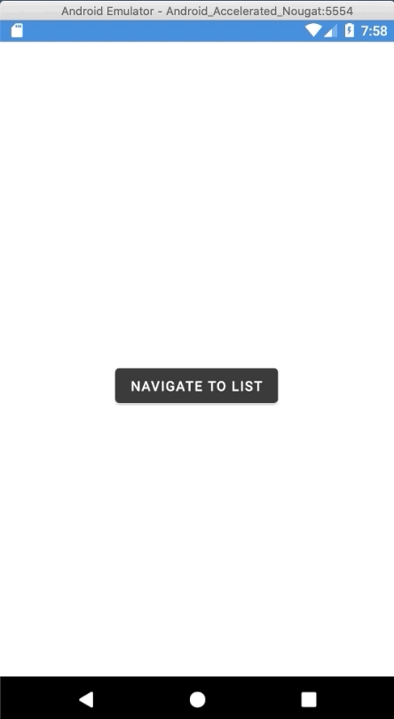

# Floating Action Button for Xamarin.Forms 

This repository shows how to create Floating Action Button in Xamarin.Forms, which animates when page is appearing.

Used libraries:
- [Sharpnado.Shadows](https://github.com/roubachof/Sharpnado.Shadows)
- [Font Awesome](https://fontawesome.com/)

Blog post: https://damianantonowicz.pl/2020/09/19/creating-animated-floating-action-button-for-xamarin-forms/

# iOS

# Android

